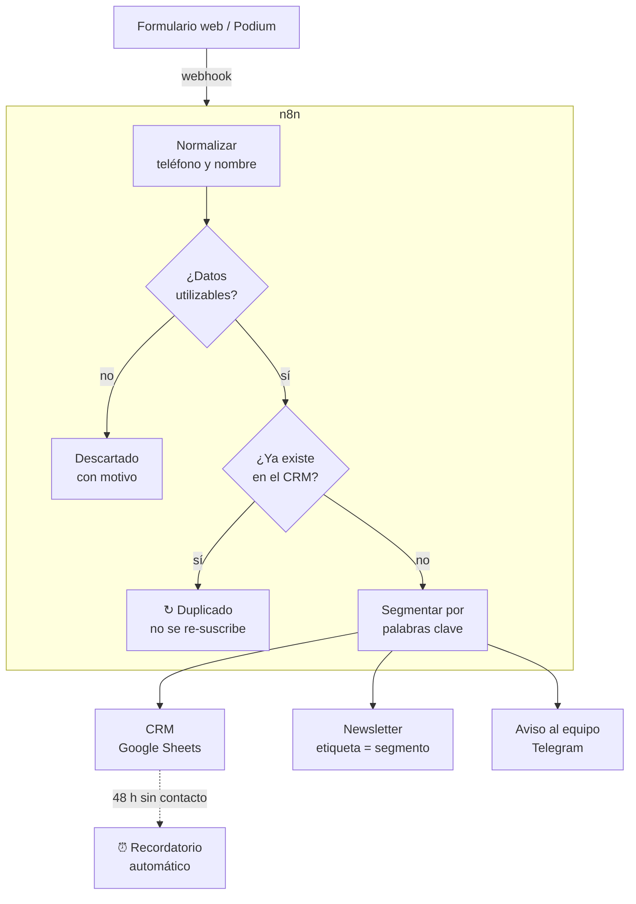
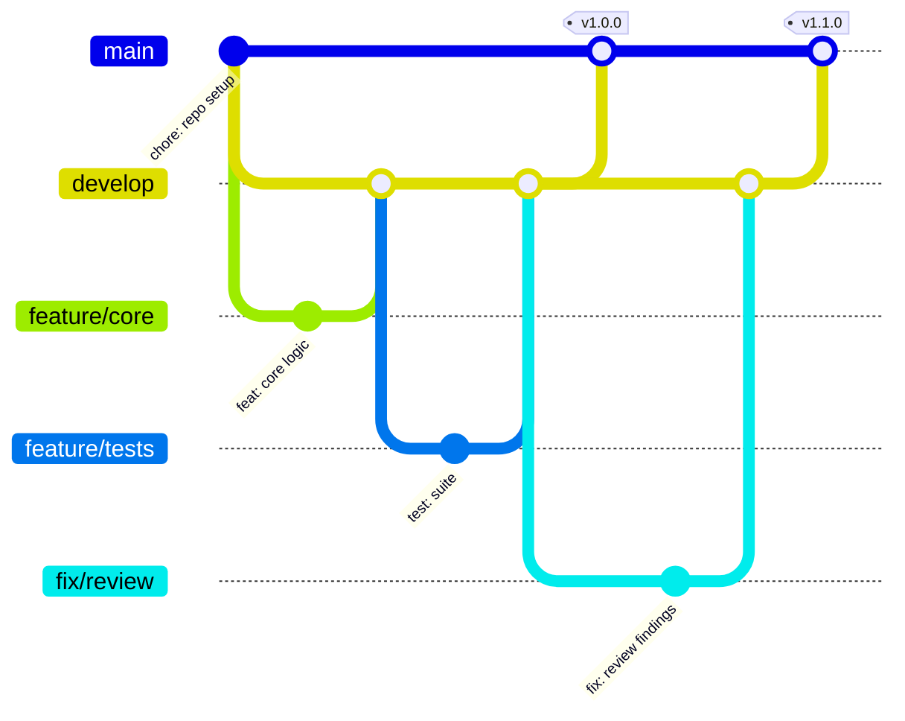

<h1 align="center">Flujo de leads con n8n</h1>

<p align="center"><i>Ningún lead se pierde y nadie copia datos a mano</i></p>

<p align="center">
  
  
  
  
</p>

---

## Demo en video

https://github.com/user-attachments/assets/0d606770-8a6e-4ed7-9171-29198633e026

<p align="center"><i>Un lead entra por el formulario, n8n lo valida, lo
clasifica por segmento y responde. La copia del archivo está en
<a href="docs/video.mp4">docs/video.mp4</a>.</i></p>

---

## El problema

Cada consulta que llega por la web o por Podium se copiaba a mano a una hoja de cálculo y a la lista de correo. Se perdían leads, se duplicaban registros y nadie sabía a quién ya se había contactado.

## Qué hace este proyecto

1. **Limpia** el dato: el teléfono queda siempre en formato `+51#########` y el nombre bien capitalizado, venga como venga del formulario.
2. **Descarta duplicados** por correo o por teléfono, aunque estén escritos distinto (`987-654-321` y `+51987654321` son la misma persona).
3. **Segmenta** en talleres, voluntariado, donación o consulta general según lo que la persona escribió.
4. **Dispara tres acciones**: registrar en el CRM, suscribir al newsletter con su etiqueta y avisar al equipo por Telegram.
5. **Persigue el seguimiento**: si nadie contactó al lead en 48 horas, manda un recordatorio.

---

## Cómo funciona



---

## Probarlo en 2 minutos

```bash
pip install pytest
python scripts/generar_data.py      # 44 leads ficticios
python scripts/simular_flujo.py     # el flujo completo, sin instalar n8n
python -m pytest -v                 # 42 tests
```

También puedes abrir `formulario_demo/index.html` con doble clic: funciona en
modo simulado sin levantar nada.

**Con n8n de verdad** (Docker):

```bash
docker compose up -d
docker exec club_stem_n8n n8n import:workflow --input=/workflows/workflow_leads_demo.json
docker exec club_stem_n8n n8n update:workflow --id=clubstemleadsdemo --active=true
docker restart club_stem_n8n
```

---

### El detalle que más cuesta ver

La lógica vive **dos veces**: en Python (para poder probarla) y en el nodo Code de n8n (para que corra en el flujo). Dos copias que se desincronizan en silencio son una bomba de tiempo, así que hay un test que **ejecuta el código del nodo fuera de n8n** y compara lead por lead contra la implementación Python.

Ese test ya evitó un bug real: `D'Angelo` salía como `D'angelo` solo en JavaScript.

---

## Estructura

```
├── src/flujo_leads.py           # la lógica, una función por nodo
├── workflows/
│   ├── src/procesar_lead.js     # el código del nodo de n8n, revisable
│   ├── workflow_leads_demo.json # importable, corre SIN credenciales
│   └── workflow_leads.json      # producción: Sheets + Mailchimp + Telegram
├── formulario_demo/             # formulario que dispara el webhook
├── scripts/                     # data ficticia, simulador y build
├── tests/                       # 42 tests (incluye paridad JS ↔ Python)
└── docker-compose.yml           # n8n self-hosted
```

---

## Flujo de trabajo con Git

El repositorio sigue **Git Flow**: `main` siempre desplegable, `develop` como
integración, y una rama por cambio. Los merges son `--no-ff` para que cada
funcionalidad quede como un bloque legible en el historial, y cada versión
lleva su tag.



| Rama | Para qué |
| --- | --- |
| `main` | Solo versiones liberadas. Cada merge lleva su tag. |
| `develop` | Integración de todo lo terminado. |
| `feature/*` | Una funcionalidad nueva. |
| `fix/*` | Una corrección concreta. |
| `release/*` | Preparación de la versión, luego se fusiona a `main` y `develop`. |

Los mensajes siguen [Conventional Commits](https://www.conventionalcommits.org/):
`feat:`, `fix:`, `test:`, `docs:`, `chore:` — con el porqué del cambio en el
cuerpo, no solo el qué.

---

## Documentación

| Documento | Contenido |
| --- | --- |
| [`GUIA.md`](GUIA.md) | Guía técnica completa: arquitectura, decisiones, configuración y puesta en marcha |
| [`DECISION_N8N_VS_MAKE.md`](DECISION_N8N_VS_MAKE.md) | Comparación por criterio, regla de decisión y plan de consolidación en tres fases |

---

## Licencia

[MIT](LICENSE) · Daniel Yataco Blas

> Proyecto de demostración construido con **datos ficticios**. No es un sistema
> en producción de ninguna organización.
